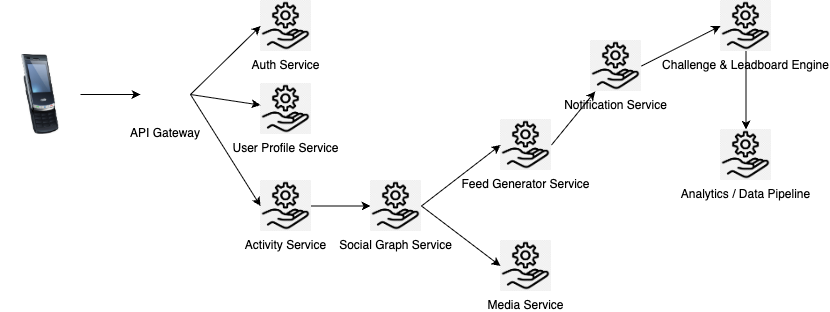

# High-Level Architecture

The architecture must efficiently support real-time ingestion of activities, social feed distribution, geospatial analysis, and user interactions — all at scale. This requires a modular, service-oriented approach with well-defined boundaries between core systems such as activity tracking, user management, social graph processing, and notification delivery.

## 1. Component Overview

The system is structured around the following main components:

- **API Gateway:** Central entry point for all client communication. Handles authentication, rate limiting, and routing to internal services.
- **Auth Service:** Manages OAuth2 flows, token issuance, session management, and integration with third-party identity providers (e.g., Apple, Google).
- **User Profile Service:** Stores personal information, preferences, equipment, and privacy settings.
- **Activity Service:** Manages ingestion of GPS-based workouts, route parsing, activity validation, and metadata extraction (e.g., pace, elevation).
- **Feed Service:** Generates and stores activity feeds, processes social graph updates, and manages fan-out for new posts.
- **Social Graph Service:** Manages follower/followee relationships and computes visibility of activities and challenges.
- **Challenge & Leaderboard Engine:** Calculates leaderboards, manages challenge logic, and updates virtual trophies and segments.
- **Media Service:** Handles uploading images (photos, route maps), CDN caching, and access control.
- **Notification Service:** Publishes real-time and batch notifications via WebSocket, FCM/APNs, or in-app inbox.
- **Analytics Pipeline:** Processes activity streams for insights, trend detection, and athlete recommendations.
- **Admin & Moderation Portal:** Tools to manage abuse reports, create challenges, and provide analytic dashboards.

## 2. High-Level Architecture Diagram

## 3. Data Flow Summary

When a user starts a workout:

1. The mobile app streams GPS and sensor data via WebSocket or batch upload to the **Activity Service**.
2. The service analyzes the data, stores the workout, and emits an event to the **Feed Generator**.
3. The **Social Graph Service** determines who can view the activity.
4. The feed item is saved and sent to relevant users via the **Notification Service**.
5. If applicable, the activity is evaluated by the **Leaderboard Engine** for challenge qualification and rank updates.
6. Photos and route visualizations are sent to the **Media Service** and stored in the CDN.

This modular design supports horizontal scalability and isolated service evolution. It also enables real-time fan-out for feeds and notifications through event-driven communication (e.g., Kafka or NATS).

---

# Database Design

## 1. Core Data Models and ERD Overview

The system uses a polyglot persistence approach — relational databases for transactional integrity, time-series/NoSQL for activity data, and graph or in-memory stores for high-performance social queries.

### Primary Entities

- **User:** Profile info, authentication settings, preferences, subscription tier
- **Activity:** Workout data including GPS points, metrics, equipment, media
- **Follow:** Follower-followee relationships and visibility rules
- **FeedItem:** Renderable events related to users (e.g., activity posted, comment, badge)
- **Challenge:** Metadata and state for group competitions
- **LeaderboardEntry:** Position and metrics for challenges or segments

### Entity Relationship Diagram (conceptual):

## 2. Database Technology Choices

Each data domain is optimized for its access pattern:

- **PostgreSQL:** Canonical source for user profiles, activities, feed metadata, and challenges. Excellent for transactional integrity and foreign key constraints.
- **TimeScaleDB / InfluxDB:** For ingestion of GPS points, activity telemetry, and time-series analysis (e.g., pace over time, heart rate zones).
- **S3 + CDN:** For raw GPS tracks storage, route images, and uploaded media (with secure pre-signed URL access).
- **Redis / Memcached:** For fast retrieval of leaderboards, recent activities, and precomputed feed data.
- **Neo4j or similar Graph DB:** For efficient social graph queries (optional based on scale and query complexity).

---
