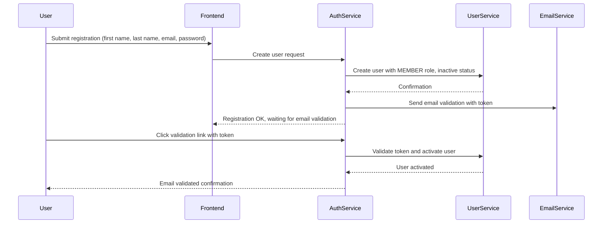
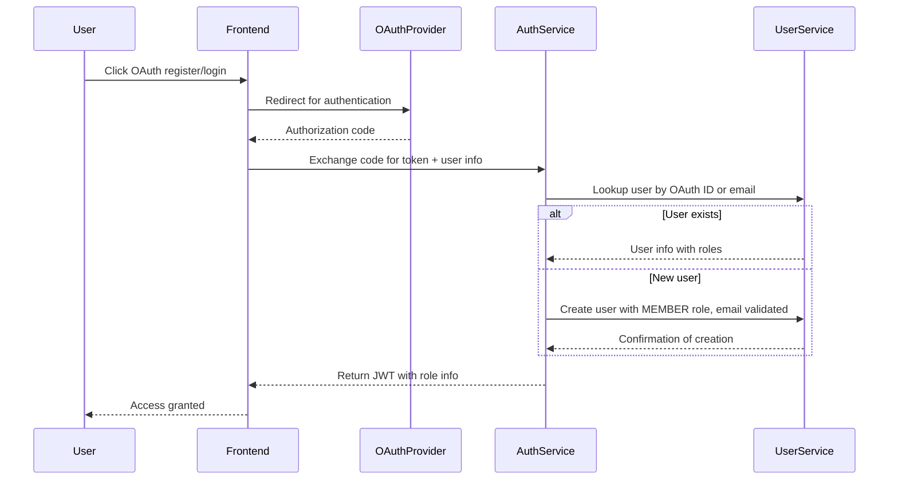
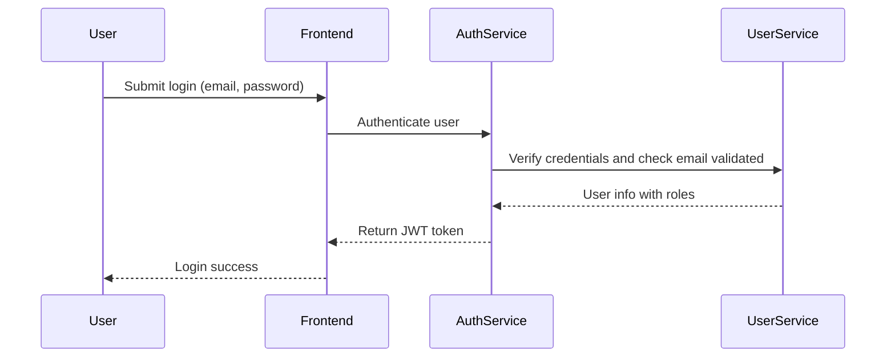
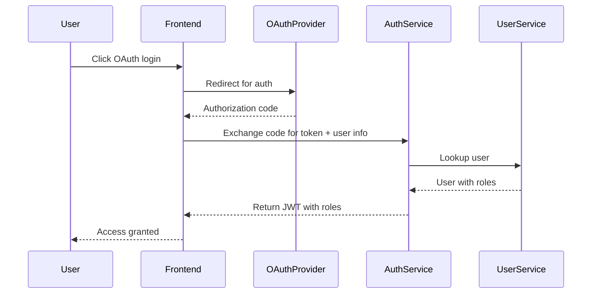
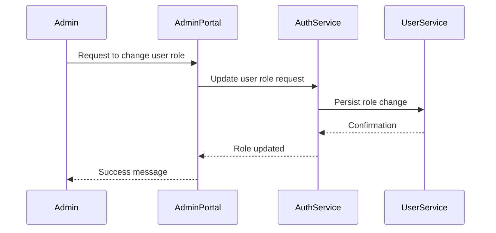

# AuthService — Use Cases & Sequence Diagrams

## 1. Registration

### Proprietary Registration (Email + Password)

Users register by providing email and password. After registration, an **email validation** step is required before the account is fully active.

- User submits registration data.
- AuthService creates the user with default role `MEMBER` (or specified role).
- Sends validation email with a unique token.
- User clicks validation link to activate the account.

---

### Sequence Diagram — Proprietary Registration & Email Validation

### OAuth Registration (Google, Facebook)

Users can also register using OAuth providers. OAuth registration combines user creation with OAuth login.

* User authenticates with OAuth provider.
* AuthService fetches user info from OAuth provider.
* If user exists, logs in; else creates user and marks email as validated.
* Assigns default role MEMBER.

#### Sequence Diagram — OAuth Registration

## 2. Login

Users can log in either via:

* Proprietary method (email + password)
* OAuth (Google, Facebook)

In both cases, the system returns a JWT including user roles.

### Sequence Diagram — Proprietary Login

### Sequence Diagram — OAuth Login

## 3. Role Assignment & Management

Roles Description

* **ROOT**: Super admin, reserved, never used in ordinary operations
* **ADMIN**: Platform administration
* **DEVOPS**: Infrastructure and deployment management
* **MODERATOR**: Content moderation within community features
* **MEMBER**: Default user role
* **PREMIUM_MEMBER**: Paid subscriber with additional features
* **COACH**: A member (normal or premium) who can view private accounts of their trainees

### Role Assignment Flow

* Roles are assigned during user creation or updated by admins.
* Role changes trigger JWT refresh or token revocation.
* Access control enforced at service level via JWT claims and RBAC.

### Example Role Assignment Sequence

## Summary

This documentation covers:

* Proprietary registration with email validation
* OAuth registration and login
* Role definitions and assignment flows

If you want, I can prepare code examples and more detailed sequence diagrams for flows such as password reset, token refresh, or role revocation next.
