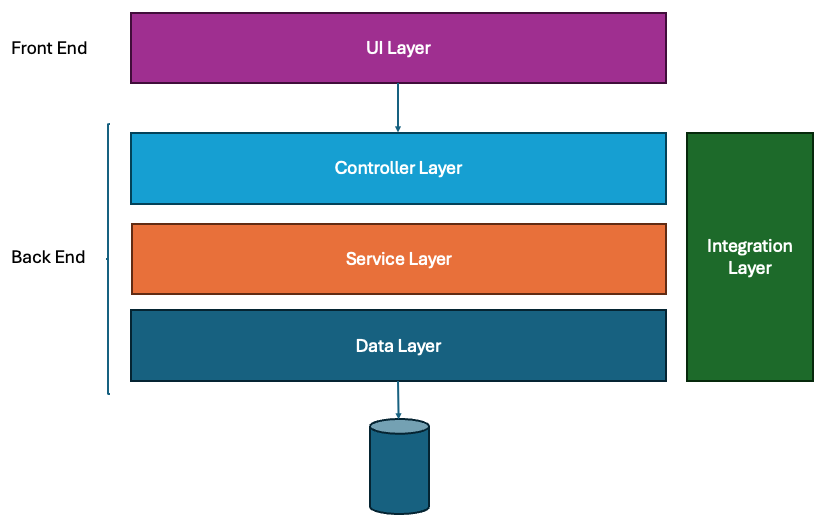

# Component Design Overview

This document outlines the high-level component design of the platform, structured across four main architectural layers: **Data Layer**, **Application Layer**, **Integration Layer**, and **UI Layer**. Each layer encapsulates distinct responsibilities — from data modeling and validation to service orchestration, external integrations, and frontend delivery.
The design emphasizes modularity, scalability, and maintainability by adopting domain-driven boundaries, clean architecture principles, and asynchronous processing patterns. Technologies and frameworks are chosen based on their performance, interoperability, and developer efficiency.
The following sections provide a detailed breakdown of the responsibilities and implementation choices within each layer.

## 1. Data Layer

### Schema Strategy

Schemas are organized around clear domain boundaries: `users`, `activities`, `feeds`, `social graphs`, and `challenges`. Enumerated types (e.g., `visibility`, `status`, `activity_type`) are used to improve indexing performance. UUIDs are favored over auto-incrementing integers to prevent hot key issues in distributed databases.

### Data Access

Access to core data is managed via thin service-layer repositories that enforce access control policies — for example, checking visibility rules before exposing activity data. Reads are optimized using materialized views and pre-joined feed snapshots. Write-heavy paths, such as activity ingestion, rely on write-ahead queues and bulk insert pipelines to handle traffic spikes smoothly.

### Validation

Validation occurs at multiple levels:
- **Edge-level:** Enforced via OpenAPI or GraphQL schemas.
- **Service-level:** Includes semantic checks like validating GPS coordinates or avoiding overlapping timestamps.
- **Background jobs:** Perform asynchronous sanity checks on telemetry and tracking data.

---

## 2. Service Layer

### Service Design

Each major domain (User, Activity, Feed, Notification, Social Graph) is encapsulated in an isolated microservice. Services expose both REST APIs (for public access) and gRPC endpoints (for internal communication). Domain logic is cleanly separated from transport and infrastructure using Clean Architecture principles.

### Frameworks & Languages

- **Go / Rust:** For performance-critical services (Activity, Feed, Leaderboard)
- **Node.js / Python:** For orchestration layers, async tasks, and integrations
- **GraphQL (Apollo / Hasura):** For declarative data access and frontend aggregation

### Authentication

- OAuth2 flows issue JWT tokens for client apps.
- Internal service-to-service communication uses signed tokens with role-based scopes.

### Rate Limiting & Quotas

Implemented using Redis-backed token buckets at both the API gateway and user level, especially relevant for endpoints such as activity uploads.

---

## 3. Integration Layer

### Message Queues

Kafka or NATS is used for asynchronous workflows, including:
- Activity processing
- Feed fan-out
- Segment matching
- Notification publishing

All consumers are designed as **idempotent handlers** to guarantee strong delivery semantics and avoid duplicate processing.

### Third-Party Sync

External integrations (e.g., Garmin, Fitbit, Apple Health) are handled via a combination of background pollers and webhook listeners. Incoming data is pushed through the same ingestion pipeline used for user-submitted activities.

### Event Types

- `activity.created` → Fan-out to feed service, notify followers
- `challenge.joined` → Verify eligibility, insert into leaderboard
- `user.followed` → Update graph, refresh feed, enqueue welcome notification

---

## 4. UI Layer (Frontend Architecture)

### App Stack

- **Mobile:** React Native with TypeScript and Redux Toolkit for state management
- **Web:** Next.js with Tailwind CSS for styling and support for SSR/ISR
- **Data Access:** GraphQL-based APIs for structured querying

### Security Measures

- OAuth PKCE flows are mandatory — client secrets are never embedded
- All API calls require signed JWTs
- Public endpoints are filtered by user role, rate, and origin
- Geolocation data is sandboxed based on visibility settings (e.g., private activities are excluded from feeds, heatmaps, and leaderboards)

### Real-Time Features

WebSockets or Server-Sent Events (SSE) are used for:
- Push notifications
- Real-time challenge updates
- Live feed refreshes

Fallback to long-polling is supported on limited-connectivity networks. The frontend also maintains a local SQLite cache to allow offline activity logging and synchronization.

---
