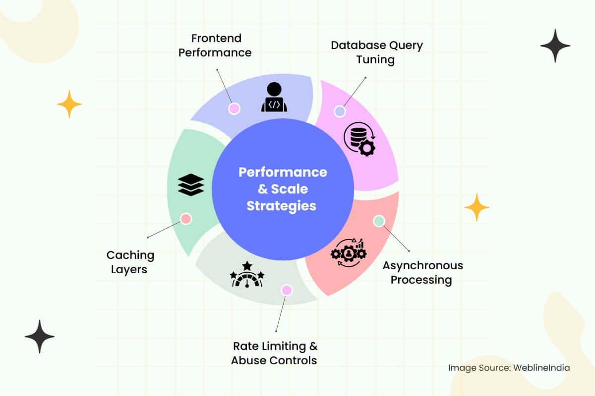

# Performance Optimization

This section describes how the platform maintains responsiveness and scalability across services, databases, and clients.

---

## 1. Database Query Tuning

### **Query Indexing**
- Every high-cardinality column used in filters or joins — such as `user_id`, `activity_id`, `created_at`, or `challenge_id` — is backed by **BTREE** or **GIN** indexes.
- **Composite indexes** are created for frequent queries like:
  - `follower_id + created_at DESC` (feeds)
  - `user_id + challenge_id` (leaderboard lookups)

### **Materialized Views**
- Daily rollups (e.g., **“total distance run this week”**) are stored as **materialized views** and refreshed via **async jobs**.
- This avoids repetitive aggregation scans and **accelerates dashboard metrics**.

### **Query Caching**
- **Redis** is used to cache data such as:
  - Leaderboards
  - Public profiles
  - Static challenge pages
- Caching uses **intelligent TTLs** and **explicit invalidation** on relevant events.

---

## 2. Asynchronous Processing

### **Deferred Workloads**
- Heavy tasks like:
  - **Segment matching**
  - **Heatmap generation**
  - **Badge evaluation**
  - **Follower feed fan-out**
- ...are deferred to **background workers** via **Kafka** or **NATS**.
- Keeps activity submission latency low (~100–200ms P99).

### **Bulk Ingestion Paths**
- Uploads from **Garmin** or **Apple Health** are:
  - **Batched**
  - **Processed in parallel**
  - **Deduplicated**
  - **Isolated** to avoid cascading failures from corrupt data.

---

## 3. Rate Limiting & Abuse Controls

### **Rate Control**
- Every API endpoint has **user-level** and **IP-level** rate limits at the **gateway**.
- High-cost operations (e.g., posting activities with media) use **adaptive throttling** based on:
  - Request latency
  - Queue lag

### **Abuse Detection**
- **ML models** monitor for patterns like:
  - Follow spam
  - Comment flooding
  - Abusive geo-posting
- Offending clients are **rate-limited**, **sandboxed**, or **flagged** for moderation.

---

## 4. Caching Layers

### **Edge Caching**
- Static assets such as:
  - Route maps
  - Profile avatars
  - Challenge pages
  - Heatmap tiles
- ...are served via **CDN edge nodes** (e.g., **Cloudflare**, **Fastly**).
- Cache keys include **version hashes** to enable fast global invalidation.

### **Client-side Caching**
- Mobile app uses **local SQLite** for offline support.
- Data is hydrated via **delta-updated JSON blobs** at:
  - App startup
  - Post-login
- Enables **instant rendering** and **smooth cold starts**.

---

## 5. Frontend Performance

### **Incremental Loading**
- Features like:
  - Feed scrolls
  - Profile views
  - Challenge lists
- ...use **infinite scroll** or **windowed pagination** with **cursor tokens**.
- Reduces payload and memory footprint on clients.

### **Image Optimization**
- Images are:
  - **Resized**
  - **Compressed**
  - **Converted** (e.g., to **WebP**)
- CDN delivers device-specific variants via **content negotiation headers**.

### **JS Bundling & Tree Shaking**
- Web clients use **modern bundlers** (e.g., **Vite**, **Webpack 5**) with:
  - **Dynamic import splitting**
  - **Tree shaking**
  - **Lazy loading** for non-critical UI (charts, maps, analytics)

---
